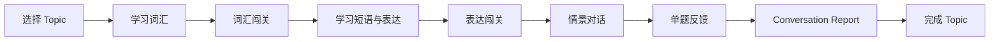

# OralApp — AI 英语口语学习产品原型

> 面向希望提升日常英语表达能力的学习者，围绕「词汇 → 表达 → 情景对话 → 学习反馈」构建完整练习闭环。

## 项目简介

OralApp 是一个移动端英语口语学习产品原型。它通过结构化学习任务降低开口练习门槛，并用即时反馈帮助用户持续改进表达。

本版本聚焦产品流程和交互验证，使用静态模拟数据实现完整体验，无需登录、后端或真实 AI 服务。

## 核心体验

- **任务式学习首页**：用 Todo List 形式展示 Topic、进度和当前任务。
- **词汇学习与闯关**：词义、例句、音标和常用搭配结合，连续答对 3 题即可通关。
- **短语与表达练习**：通过日常情境对话学习自然表达，再用选择题巩固。
- **模拟口语对话**：支持麦克风交互演示和文字输入，模拟聆听、分析与评分流程。
- **反馈与学习报告**：展示流畅度、词汇丰富度、语法正确度和自然表达等指标。
- **学习记录**：汇总学习时长、完成关卡、近期进步和待复习内容。

## 用户学习路径

## 设计思路

| 设计目标 | 对应方案 |
| --- | --- |
| 降低学习压力 | 使用轻量卡片、淡蓝色体系和清晰的单任务界面 |
| 明确下一步 | 当前关卡突出显示，未解锁内容降低视觉权重 |
| 提供即时成就感 | 答题反馈、连续答对计数和完成页即时呈现 |
| 建立学习闭环 | 学习、练习、对话、反馈和记录串联为完整流程 |
| 便于快速验证 | 单文件静态原型，无需账号、API 或后端即可体验 |

## 页面范围

本原型覆盖 14 类页面或状态：

1. 学习首页 / Topic Todo List
2. Vocabulary 单词概览
3. Vocabulary 单词详情
4. Vocabulary 闯关
5. Phrases & Sentences 学习
6. Phrases & Sentences 闯关
7. 普通关卡完成页
8. Conversation 对话页
9. Conversation 单题反馈
10. Conversation Report
11. Topic 完成页
12. 学习记录
13. 复习占位页
14. 我的

## 视觉规范

- 主色：`#2F73F6`
- 成功色：`#43C98B`
- 页面背景：`#F7F9FC`
- 手机画布：`390 × 844px`
- 设计语言：轻量、清晰、卡片化，避免过度游戏化

## 原型说明

- 使用原生 HTML、CSS 和 JavaScript 构建。
- 所有数据均为静态 Demo 数据。
- 语音识别、AI 分析和评分为交互模拟。
- 学习状态仅保存在当前页面内存中，刷新后恢复初始状态。
- 支持桌面浏览器和移动端尺寸预览。

## 我的工作

- 产品信息架构与学习流程设计
- 14 类页面及状态梳理
- 移动端 UI 规范与组件设计
- 交互原型开发
- 闯关、解锁、反馈和报告流程实现

## 本地运行

直接打开 `index.html`，或在项目目录启动任意静态文件服务器即可体验。

---

如果你正在查看我的简历，欢迎点击页面顶部的 **Live Demo** 体验完整原型。
